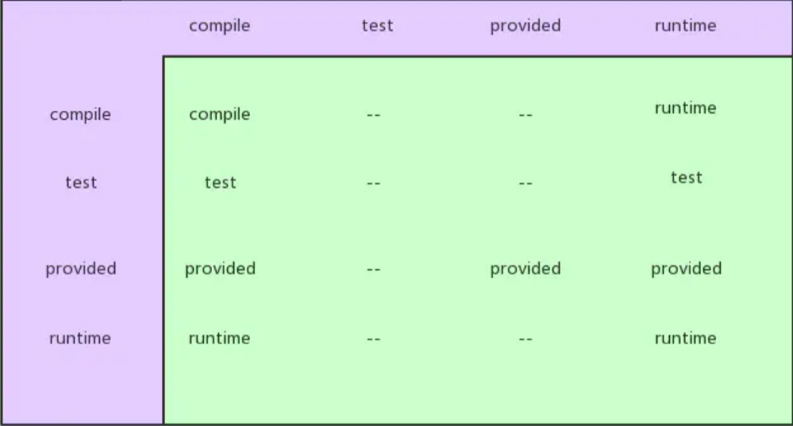

## Maven Pom

### 基本信息

* modelVersion：指定当前POM模型的版本
* groupId：项目的所属公司或组织的域名倒写
* artifactId：如果该项目为一个Maven模块，则相当于项目名；如果一个项目包含多个子模块，则它们该模块的名称；（一般和项目同名）
* version：该项目的版本信息
* name：项目名，作用只是一个更友好的项目名称，不是必须的
* packaging：打包方式，默认为jar

### 依赖管理

* groupId：如上groupId
* artifactId：如上artifactId
* version：如上version
* type：如上packaging，默认为jar
* scope:依赖的范围 
* optional：标记依赖是否可选
* exclusions：用来排除一些传递性依赖

#### 依赖范围（scope）

* compile：编译依赖范围
  * 如果没有指定、默认为该依赖范围
  * 使用此范围，对于编译、测试、运行三种classpath都有效
* test：测试依赖范围
  * 只对测试classpath有效
  * 在编译主代码和运行项目使用时将无法使用此类依赖
  * 如 JUnit
* provided：编译及测试依赖范围
  * 对于编译及测试classpath有效，但是在运行时无效
  * 例如servlet-api,编译和测试项目时需要该依赖，但是在运行项目的时候，容器已经提供，所以不需要Maven重复引入一遍
* runtime：运行时依赖范围
  * 对于测试和运行的classpath有效
  * 例如JDBC的驱动实现，项目主代码的编译只需要JDK提供的JDBC接口，只有在执行测试或者运行项目的时候才需要具体JDBC的实现
* system：系统依赖范围
  * 依赖范围和provided的范围完全一致
  * 使用该范围需要使用systemPath元素显式的依赖文件的路径
  * 往往和本机绑定，可能造成构建的不可移植

#### 传递性依赖（exclusions）

>什么是传递性依赖？
>例如一个项目依赖spring-core的jar包，然后spring-core依赖commons-logging，则commons-logging为该项目的一个传递性依赖

#### 传递性依赖和依赖范围

>依赖范围不仅可以控制依赖与三种classpath的关系，还对传递性依赖产生影响
>
>例如：假设A依赖B，B依赖C，A对于B是第一直接依赖、B对于C是第二直接依赖、A对于C是传递性依赖

#### 依赖调解

例如有项目A存在以下关系：A -> B -> C -> X(1.0)、A -> D -> X(2.0)，X是A的传递性依赖，但是却有两个版本的X，Maven有两个原则去调解依赖重复。

- 路径最近者优先
- 第一声明者优先
   最好的做法：可使用exclusions标签对一些传递性依赖进行排除

#### 可选依赖（**optional**）

假如项目A依赖项目B，项目B依赖于项目X和Y，B对于X和Y都是可选依赖：A -> B、B -> X\Y（可选），X、Y不会得以传递，称为传递性依赖。
 引入这种依赖特性的原因主要是，可能项目B实现了两个特性，一个特性依赖X，一个特性依赖Y，而且这两个特性是互斥的

### 构建管理（Build）

* finalName：构建目标文件的名称，默认情况为${artifactId}-${version}
* defaultGoal：如果指定值package，则相当于执行命令mvn package
* directory：构建目标文件的存放目录，默认在${basedir}/target目录中
* plugins：插件的配置，具体的插件配置可进行查阅
* resource：[传送门 ~~](https://links.jianshu.com/go?to=https%3A%2F%2Fblog.csdn.net%2Fu011781521%2Farticle%2Fdetails%2F79052725)pluginManagement：[传送门~~](https://www.jianshu.com/p/23824d655590)