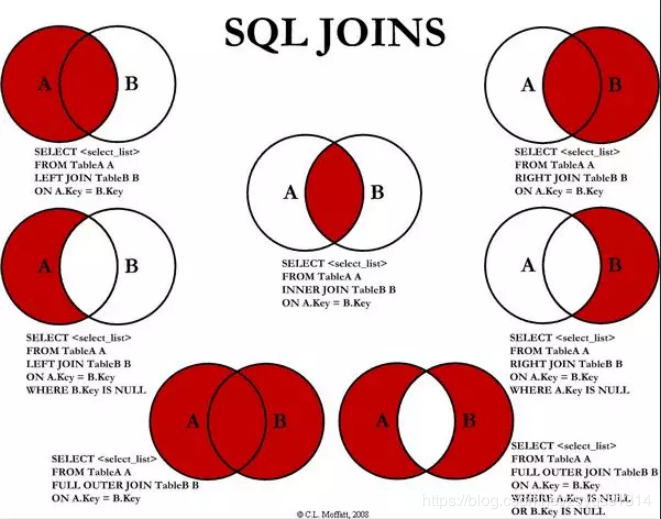
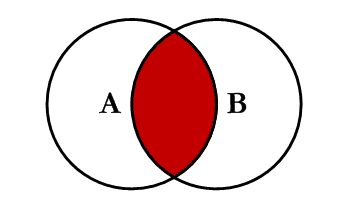
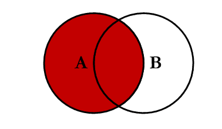
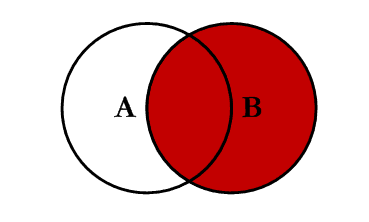
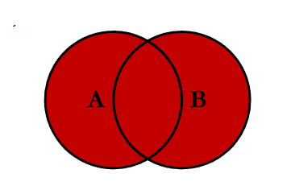
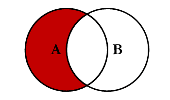
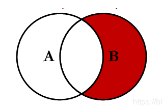
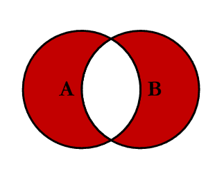

## 连表查询




### 内连接 `inner join`



```mysql
SELECT * FROM TABLE_A  A  INNER JOIN TABLE_B B ON A.KEY = B.KEY
```

### 左连接 `LEFT JOIN `



```mysql
SELECT * FROM TABLE_A A LEFT JOIN TABLE_B B ON A.KEY = B.KEY
```


### 右连接 `RIGHT JOIN`



```mysql
SELECT * FROM TABLE_A A RIGHT JOIN TABLE_B B ON  A.KEY = B.KEY
```


### 外连接 `OUTER JOIN`



```mysql
SELECT * FROM TABLE_A A FULL OUTER JOIN TABLE_B B ON A.KEY = B.KEY
```


### 左连接 - 内连接 ` LEFT JOIN EXCLUDING INNER JOIN `



```mysql
SELECT * FROM TABLE_A A LEFT JOIN TABLE_B ON A.KEY = B.KEY WHERE B.KEY IS NULL
```

### 右连接 - 内连接 `RIGHT JOIN EXCLUDING INNER JOIN`



```mysql
SELECT * FROM TABLE_A A RIGHT JOIN TABLE_B B ON A.KEY = B.KEY WHERE A.KEY IS NULL
```


### 外连接 - 内连接 `OUTER JOIN EXCLUDING INNER JOIN`



```mysql
SELECT * FROM TABLE_A FULL OUTER JOIN TABLE_B B ON A.KEY = B.KEY WHERE A.KEY IS NULL OR B.KEY IS NULL
```

