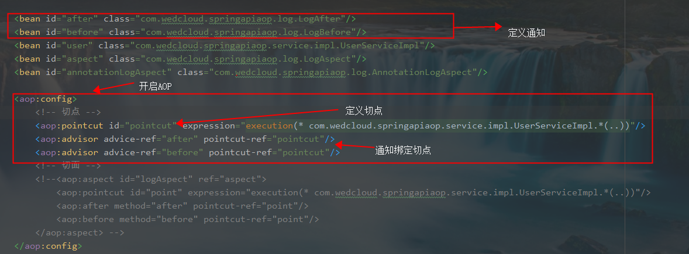
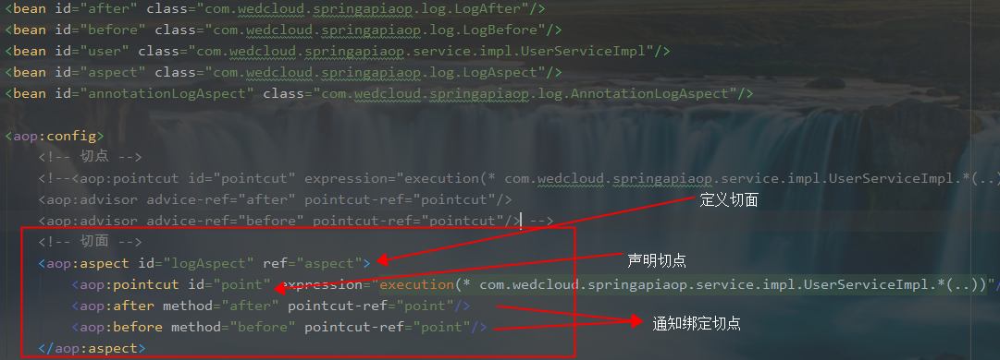

## AOP

Spring AOP 底层 -- 代理模式

### 代理模式

#### 静态代理

角色分析：

* 抽象角色：一般使用接口或者抽象类来解决
* 真实角色：被代理的角色
* 代理角色：代理真实角色，代理真实角色之后，通常还会做一些附属操作（公共的业务）

静态代理模式的好处：

- 使真实角色的操作更加纯粹
- 公共业务交给代理角色，实现业务分工
- 公共业务发生扩展的时候，方便集中管理

缺点：

* 一个真实角色就会产生一个代理角色，代码量大，开发效率低

#### 动态代理

* 动态代理和静态代理角色一样
* 动态代理的代理类是动态生成的，不是我们直接写好的
* 动态代理分为两大类：基于接口的动态代理，基于类动态代理
  - 基于接口的：JDK动态代理【常用】
  - 基于类： cglib
  - Java字节码实现：Javasist

好处：

- 使真实角色的操作更加纯粹
- 公共业务交给代理角色，实现业务分工
- 公共业务发生扩展的时候，方便集中管理
- 一个动态代理类，代理的是一个接口，一般每一个接口对应的就是一类业务
- 一个动态代理类，可以代理多个类，只要实现统一接口即可


### 什么是AOP

* AOP（Aspect Oriented Programming）称为面向切面编程，在程序开发中主要用来解决一些系统层面上的问题，比如日志，事务，权限等待，Struts2的拦截器设计就是基于AOP的思想，是个比较经典的例子。

* 在不改变原有的逻辑的基础上，增加一些额外的功能。代理也是这个功能，读写分离也能用aop来做。

* AOP可以说是OOP（Object Oriented Programming，面向对象编程）的补充和完善。OOP引入封装、继承、多态等概念来建立一种对象层次结构，用于模拟公共行为的一个集合。不过OOP允许开发者定义纵向的关系，但并不适合定义横向的关系，例如日志功能。日志代码往往横向地散布在所有对象层次中，而与它对应的对象的核心功能毫无关系对于其他类型的代码，如安全性、异常处理和透明的持续性也都是如此，这种散布在各处的无关的代码被称为横切（cross cutting），在OOP设计中，它导致了大量代码的重复，而不利于各个模块的重用

* AOP技术恰恰相反，它利用一种称为"横切"的技术，剖解开封装的对象内部，并将那些影响了多个类的公共行为封装到一个可重用模块，并将其命名为"Aspect"，即切面。所谓"切面"，简单说就是那些与业务无关，却为业务模块所共同调用的逻辑或责任封装起来，便于减少系统的重复代码，降低模块之间的耦合度，并有利于未来的可操作性和可维护性

* 使用"横切"技术，AOP把软件系统分为两个部分：核心关注点和横切关注点。业务处理的主要流程是核心关注点，与之关系不大的部分是横切关注点。横切关注点的一个特点是，他们经常发生在核心关注点的多处，而各处基本相似，比如权限认证、日志、事物。AOP的作用在于分离系统中的各种关注点，将核心关注点和横切关注点分离开来

  

### AOP相关概念

1. 横切关注点：对哪些方法进行拦截，拦截后怎么处理，这些关注点称之为横切关注点
2. Aspect(切面):通常是一个类，里面可以定义切入点和通知
3. JointPoint(连接点):程序执行过程中明确的点，一般是方法的调用。被拦截到的点，因为Spring只支持方法类型的连接点，所以在Spring中连接点指的就是被拦截到的方法，实际上连接点还可以是字段或者构造器
4. Advice(通知):AOP在特定的切入点上执行的增强处理，有before(前置),after(后置),afterReturning(最终),afterThrowing(异常),around(环绕)
5. Pointcut(切入点):就是带有通知的连接点，在程序中主要体现为书写切入点表达式
6. weave(织入)：将切面应用到目标对象并导致代理对象创建的过程
7. introduction(引入)：在不修改代码的前提下，引入可以在**运行期**为类动态地添加一些方法或字段
8. AOP代理(AOP Proxy)：AOP框架创建的对象，代理就是目标对象的加强。Spring中的AOP代理可以使JDK动态代理，也可以是CGLIB代理，前者基于接口，后者基于子类
9. 目标对象（Target Object）: 包含连接点的对象。也被称作被通知或被代理对象

### Advice 类型

1. Before:在目标方法被调用之前做增强处理,@Before只需要指定切入点表达式即可

2. AfterReturning:在目标方法正常完成后做增强,@AfterReturning除了指定切入点表达式后，还可以指定一个返回值形参名returning,代表目标方法的返回值
3. AfterThrowing:主要用来处理程序中未处理的异常,@AfterThrowing除了指定切入点表达式后，还可以指定一个throwing的返回值形参名,可以通过该形参名来访问目标方法中所抛出的异常对象
4. After:在目标方法完成之后做增强，无论目标方法时候成功完成。@After可以指定一个切入点表达式
5. Around:环绕通知,在目标方法完成前后做增强处理,环绕通知是最重要的通知类型,像事务,日志等都是环绕通知,注意编程中核心是一个ProceedingJoinPoint

### AOP 场景

>*Authentication 权限*
 *Caching 缓存*
 *Context passing 内容传递*
 *Error handling 错误处理*
 *Lazy loading　懒加载*
 *Debugging　　调试*
 *logging, tracing, profiling and monitoring　记录跟踪　优化　校准*
 *Performance optimization　性能优化*
 *Persistence　　持久化*
 *Resource pooling　资源池*
 *Synchronization　同步*
 *Transactions 事务*


### AOP依赖包

使用aop依赖包除了Spring提供给开发者的jar包外，还需额外上网下载两个jar包：
1、aopalliance.jar
2、aspectjweaver.jar

### 使用AOP方式

1. 经典的基于代理的AOP

2. @AspectJ注解驱动的切面

   > ```java
   > @Aspect
   > public class AnnotationLogAspect {
   >     @After("execution(* com.wedcloud.springapiaop.service.impl.UserServiceImpl.*(..))")
   >     public void after(){
   >         System.out.println("after");
   >     }
   > 
   >     @Before("execution(* com.wedcloud.springapiaop.service.impl.UserServiceImpl.*(..))")
   >     public void before(){
   >         System.out.println("before");
   >     }
   > }
   > ```
   >
   > XML开启注解AOP
   >
   > ```java
   > <aop:aspectj-autoproxy/>
   > ```

3. 纯POJO切面（纯粹通过<aop:fonfig>标签配置）

   

4. 注入式AspectJ切面
   