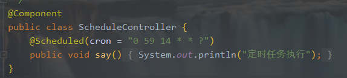

## SpringBoot 任务

### 异步任务

* 开启异步（启动类上配置 @EnableAsync）

* 在需要异步的方法或类上使用@Async

* （可选）自定义异步线程池

  ```
  @Configuration
  public class ThreadPoolExecutorConfig {
      private static final int THREADS = Runtime.getRuntime().availableProcessors() + 1;
      final ThreadFactory threadFactory = new ThreadFactoryBuilder()
              // -%d不要少
              .setNameFormat("async-task-name-%d")
              .setDaemon(true)
              .build();
  
      @Bean("taskExecutor")
      public Executor taskExecutor() {
          return new ThreadPoolExecutor(THREADS, 2 * THREADS,
                  5, TimeUnit.SECONDS,
                  new LinkedBlockingQueue<>(1024),
                  threadFactory, (r, executor) -> {
              // 打印日志,添加监控等
              System.out.println("task is rejected!");
          });
      }
  }
  ```

* （可选）使用自定义线程池后，使用@Async("taskExecutor") 指明你所使用的线程池

### 邮件任务

* 引入邮件包
* 创建简单或者复杂邮件
* 编写邮件基本信息
* 编写正文（复杂邮件可以是html等富文本）
* 发送

### 定时任务

1. 开启定时任务

   >@EnableScheduling
   >添加在启动类上

2. 配置定时任务
   

3. cron

   > 表达式有至少6个（也可能7个）有空格分隔的时间元素
   >
   > 按顺序，依次为：
   >
   > 秒（0~59）
   >
   > 分钟（0~59）
   >
   > 小时（0~23）
   >
   > 天（月）（0~31，但是你需要考虑你月的天数）
   >
   > 月（0~11）
   >
   > 天（星期）（1~7 1=SUN 或 SUN，MON，TUE，WED，THU，FRI，SAT）
   >
   > 7.年份（1970－2099）
   >
   > 
   >
   > 注意：每个元素可以是一个值(如6),一个连续区间(9-12),一个间隔时间(8-18/4)(/表示每隔4小时),一个列表(1,3,5),通配符。
   >
   > 由于"月份中的日期"和"星期中的日期"这两个元素互斥的,必须要对其中一个设置?
   >
   > 
   >
   > \*  表示所有值。 例如:在分的字段上设置 *,表示每一分钟都会触发。
   >
   > ?  表示不指定值。使用的场景为不需要关心当前设置这个字段的值。例如:要在每月的10号触发一个操作，但不关心是周几，所以需要周位置的那个字段设置为”?” 具体设置为 0 0 0 10 * ?
   >
   > \-  表示区间。例如 在小时上设置 “10-12”,表示 10,11,12点都会触发。
   >
   > ,  表示指定多个值，例如在周字段上设置 “MON,WED,FRI” 表示周一，周三和周五触发
   >
   > /  用于递增触发。如在秒上面设置”5/15” 表示从5秒开始，每增15秒触发(5,20,35,50)。 在月字段上设置’1/3’所示每月1号开始，每隔三天触发一次。
   >
   > L 表示最后的意思。在日字段设置上，表示当月的最后一天(依据当前月份，如果是二月还会依据是否是润年[leap]), 在周字段上表示星期六，相当于”7”或”SAT”。如果在”L”前加上数字，则表示该数据的最后一个。例如在周字段上设置”6L”这样的格式,则表示“本月最后一个星期五”
   >
   > `注意：在使用“L”参数时，不要指定列表或范围，因为这会导致问题`
   >
   > W 表示离指定日期的最近那个工作日(周一至周五). 例如在日字段上置”15W”，表示离每月15号最近的那个工作日触发。如果15号正好是周六，则找最近的周五(14号)触发, 如果15号是周未，则找最近的下周一(16号)触发.如果15号正好在工作日(周一至周五)，则就在该天触发。如果指定格式为 “1W”,它则表示每月1号往后最近的工作日触发。如果1号正是周六，则将在3号下周一触发。(注，”W”前只能设置具体的数字,不允许区间”-“)。
   >
   > \# 序号(表示每月的第几个周几)，例如在周字段上设置”6#3”表示在每月的第三个周六.注意如果指定”#5”,正好第五周没有周六，则不会触发该配置(用在母亲节和父亲节再合适不过了) ；小提示：’L’和 ‘W’可以一组合使用。如果在日字段上设置”LW”,则表示在本月的最后一个工作日触发；周字段的设置，若使用英文字母是不区分大小写的，即MON与mon相同。

   | 字段       | 允许值            | 允许的特殊字符  |
   | ---------- | ----------------- | --------------- |
   | 秒         | 0-59              | , - * /         |
   | 分         | 0-59              | , - * /         |
   | 小时       | 0-23              | , - * /         |
   | 日期       | 1-31              | , - * ? / L W C |
   | 月份       | 1-12 或者 JAN-DEC | , - * /         |
   | 星期       | 1-7 或者 SUN-SAT  | , - * ? / L C # |
   | 年（可选） | 留空, 1970-2099   | , - * /         |

   > 例子：
   >
   > 0 0 10,14,16 * * ? 每天上午10点，下午2点，4点
   > 0 0/30 9-17 * * ?   朝九晚五工作时间内每半小时
   > 0 0 12 ? * WED 表示每个星期三中午12点 
   > "0 0 12 * * ?" 每天中午12点触发 
   > "0 15 10 ? * *" 每天上午10:15触发 
   > "0 15 10 * * ?" 每天上午10:15触发 
   > "0 15 10 * * ? *" 每天上午10:15触发 
   > "0 15 10 * * ? 2005" 2005年的每天上午10:15触发 
   > "0 * 14 * * ?" 在每天下午2点到下午2:59期间的每1分钟触发 
   > "0 0/5 14 * * ?" 在每天下午2点到下午2:55期间的每5分钟触发 
   > "0 0/5 14,18 * * ?" 在每天下午2点到2:55期间和下午6点到6:55期间的每5分钟触发 
   > "0 0-5 14 * * ?" 在每天下午2点到下午2:05期间的每1分钟触发 
   > "0 10,44 14 ? 3 WED" 每年三月的星期三的下午2:10和2:44触发 
   > "0 15 10 ? * MON-FRI" 周一至周五的上午10:15触发 
   > "0 15 10 15 * ?" 每月15日上午10:15触发 
   > "0 15 10 L * ?" 每月最后一日的上午10:15触发 
   > "0 15 10 ? * 6L" 每月的最后一个星期五上午10:15触发 
   > "0 15 10 ? * 6L 2002-2005" 2002年至2005年的每月的最后一个星期五上午10:15触发 
   > "0 15 10 ? * 6#3" 每月的第三个星期五上午10:15触发 

4. fixedRate & fixedRateString

   >1. `fixedRate` 该属性的含义是上一个调用开始后再次调用的延时（不用等待上一次调用完成），这样就会存在重复执行的问题，所以不是建议使用，但数据量如果不大时在配置的间隔时间内可以执行完也是可以使用的
   >2. `fixedRateString` 作用基本和 `fixedRate `一样，只是传入参数不同

5. fixedDelay & fixedDelayString

   > 1. `fixedDelay ` 该属性的功效与上面的fixedRate则是相反的，配置了该属性后会等到方法执行完成后延迟配置的时间再次执行该方法
   > 2. `fixedDelayString` 作用基本和 `fixedDelay`一样，只是传入参数不同

6. initialDelay & initialDelayString

   > 1. `initialDelay `该属性跟上面的fixedDelay、fixedRate有着密切的关系，该属性的作用是第一次执行延迟时间，只是做延迟的设定，并不会控制其他逻辑，所以要配合fixedDelay或者fixedRate来使用
   > 2. `initialDelay ` 作用基本和 `initialDelayString`一样，只是传入参数不同
   > 3. 只在第一次容器启动的时候会延时