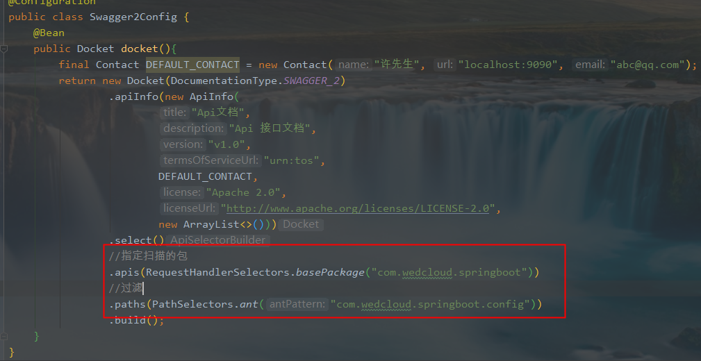
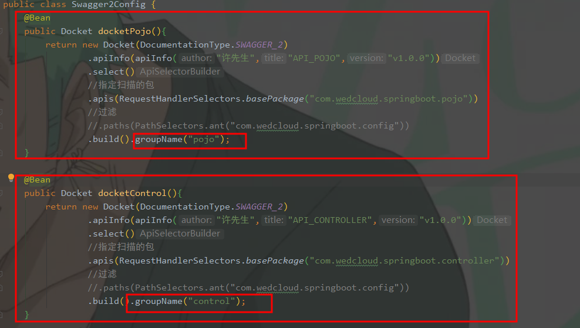

## swagger

### swagger 配置信息

> Docket.apiInfo()

```java
@Configuration
public class Swagger2Config {
    @Bean
    public Docket docket(){
        final Contact DEFAULT_CONTACT = new Contact(
            "许先生", 
            "localhost:9090",
            "abc@qq.com");
    return new Docket(DocumentationType.SWAGGER_2).apiInfo(
        new ApiInfo(
            "Api文档", 
            "Api 接口文档", 
            "v1.0", 
            "urn:tos",
            DEFAULT_CONTACT,
            "Apache 2.0",
            "http://www.apache.org/licenses/LICENSE-2.0",
            new ArrayList<VendorExtension>()));
    }
}
```

### swagger 配置扫描接口

> Docket.select()



requestHandlerSelectors

* any() 所有
* none() 不扫描
* withClassAnnotation(注解.class) 扫描带有指定注解的类
* withMethodAnnotation(注解.class) 扫描带有指定注解的方法
* basePackage（包路径） 扫描指定包下的所有（常用）

PathSelectors

* ant 指定路径过滤（常用）
* any 过滤所有
* none 不过滤
* regex 正则过滤

### 启动web访问swagger

> Docket.enable(false) 关闭swagger web页面访问
>
> Docket.enable(true) 开启swagger web页面访问（默认）

### 开启swagger

> 启动类或swagger对应的config类上注解@EnableSwagger2

### 配置分组

> Docket.groupName(组名)

#### 配置多个分组



多个`Docket`的`bean`实例即可；

### Swagger 小结

* 增加注释信息
* 接口文档是实时更新
* 在线测试

> 注意： 正式发布时，关闭Swagger，一方面是安全，另一方面是可以节省运行内存